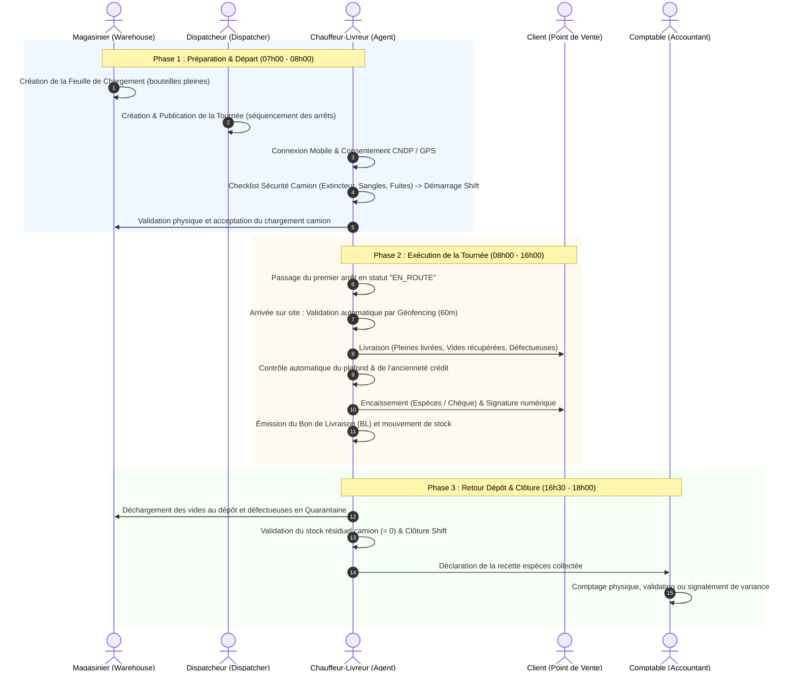

# Plateforme de Distribution de Bouteilles de Gaz — Guide d'Utilisation & Pipeline Opérationnel

Ce guide détaille le cycle opérationnel quotidien complet de la plateforme, du chargement matinal à la réconciliation comptable en fin de journée, pour l'ensemble des 6 rôles du système.

---

## 1. Identifiants & Comptes de Démonstration

* **Mot de passe universel (développement) :** `Passw0rd!`
* **Code OTP en environnement Dev :** Affiché dans la console du backend ou dans le champ `dev_code` de la réponse API.
* **URLs d'accès :**
  * **Tableau de bord Web :** `http://localhost:3000`
  * **API Backend & Swagger :** `http://127.0.0.1:8000/docs`
  * **Application Mobile :** Flutter (Android / Émulateur pointant vers `10.0.2.2:8000`)

| Rôle | Nom Démo | Téléphone | Interface principale | Responsabilité clé |
| :--- | :--- | :--- | :--- | :--- |
| **Owner** | Youssef Benali | `+212600000001` | Dashboard Web | Supervision globale, paramétrage, dérogations de crédit |
| **Dispatcher** | Fatima Zahra | `+212600000002` | Dashboard Web (`/routes`) | Planification et séquencement des tournées |
| **Warehouse** | Karim Idrissi | `+212600000003` | Dashboard Web (`/stock`) & API | Chargement camion, stocks dépôt & zone quarantaine |
| **Agent** | Ahmed Alaoui | `+212600000004` | Application Mobile Flutter | Exécution terrain, géofencing, livraison & encaissement |
| **Accountant** | Leila Haddad | `+212600000005` | Dashboard Web (`/cash`) | Réconciliation de caisse, validation des écarts |
| **Auditor** | Inspecteur Audit | `+212600000006` | Dashboard Web (`/audit`) | Contrôle des pistes d'audit et conformité CNDP |

---

## 2. Pipeline Opérationnel Chronologique (Journée Type)

---

## 3. Guide Pas-à-Pas par Rôle

### 1. Dispatcheur (`dispatcher`)
* **Mission :** Organiser les livraisons pour chaque camion et conducteur.
* **Procédure sur le Dashboard (`/routes`) :**
  1. Se connecter avec le numéro `+212600000002`.
  2. Naviguer vers l'onglet **Tournées** (`/routes`).
  3. Sélectionner le shift actif du chauffeur et la date prévue.
  4. Ajouter les points de vente (outlets) dans l'ordre d'itinéraire optimal (séquence 1, 2, 3...).
  5. Cliquer sur **Publier la tournée**. La tournée passe de `DRAFT` à `PUBLISHED` et devient immédiatement visible sur le smartphone du chauffeur.

---

### 2. Magasinier / Chef de Dépôt (`warehouse`)
* **Mission :** Assurer la traçabilité des stocks de bouteilles (pleines, vides et défectueuses).
* **Procédure :**
  1. **Au départ du camion :**
     * Émettre la feuille de chargement (*Load Sheet*) spécifiant le camion et les quantités par calibre (Butane 3kg, Butane 12kg, Propane 35kg).
     * Les bouteilles sont transférées du stock `depot` vers le stock mobile `vehicle`.
  2. **Au retour du camion :**
     * Assister au déchargement :
       * Bouteilles vides retournées -> Remises au stock central `depot`.
       * Bouteilles défectueuses/fuyardes -> Stockées sous séquestre dans l'emplacement `quarantine`.
       * Bouteilles pleines invendues -> Réintégrées au stock `depot`.
  3. **Suivi des stocks :** Consulter l'onglet **Stock** (`/stock`) pour vérifier les soldes en temps réel par emplacement.

---

### 3. Chauffeur-Livreur (`agent`)
* **Mission :** Réaliser les livraisons géoréférencées, récupérer les emballages consignés et encaisser les règlements.
* **Procédure sur l'Application Mobile (Flutter) :**
  1. **Connexion & Conformité CNDP :**
     * Saisir son numéro de téléphone `+212600000004` et le code OTP reçu.
     * Accepter les autorisations de géolocalisation et le consentement réglementaire de traitement des données de tournée (CNDP).
  2. **Checklist Sécurité Véhicule :**
     * Réaliser l'inspection pré-départ obligatoire : validité de l'extincteur, état des sangles d'arrimage, respect des normes d'empilement, détection olfactive/visuelle de fuite de gaz.
     * Renseigner le kilométrage odomètre et valider pour démarrer le shift (`ACTIVE`).
  3. **Prise en charge du chargement :**
     * Vérifier physiquement les bouteilles à bord et accepter la feuille de chargement.
  4. **Livraison sur le Point de Vente :**
     * Sélectionner le stop et cliquer sur **En route**.
     * À l'approche du client, le système valide la présence physique grâce au **géofencing automatique** (rayon maximal de 60 mètres et précision GPS ≤ 50 m).
     * Saisir le nombre de bouteilles pleines livrées, de bouteilles vides reprises et de bouteilles défectueuses.
     * Saisir le montant payé en espèces par le commerçant et le nom du réceptionnaire.
     * Valider la livraison : le reçu numérique est édité.
  5. **Déclaration d'incident de sécurité (si applicable) :**
     * En cas de fuite ou de danger, ouvrir le menu **Sécurité**, sélectionner la gravité (`CRITICAL`, `HIGH`, `LOW`), photographier la bouteille et soumettre l'alerte immédiate.
  6. **Fin de journée & Clôture :**
     * Au dépôt, saisir l'inventaire de déchargement.
     * Déclarer le total du montant en espèces collecté pendant la journée.

---

### 4. Caissier / Responsable Financier (`accountant`)
* **Mission :** Valider la recette monétaire et surveiller les encours clients.
* **Procédure sur le Dashboard (`/cash`) :**
  1. Se connecter avec le numéro `+212600000005`.
  2. Naviguer vers l'onglet **Trésorerie** (`/cash`).
  3. Sélectionner la remise de caisse soumise par le chauffeur.
  4. Comparer le **montant attendu** (calculé automatiquement d'après les encaissements enregistrés) et le **montant déclaré**.
  5. Procéder au comptage physique et cliquer sur **Vérifier** :
     * Si le montant concorde : la remise passe au statut `VERIFIED`.
     * En cas d'écart (manquant ou surplus) : renseigner obligatoirement le motif de variance pour flagger l'écart dans la piste d'audit.

---

### 5. Propriétaire / Directeur d'Exploitation (`owner`)
* **Mission :** Pilotage stratégique, supervision des marges et dérogations exceptionnelles.
* **Fonctionnalités clés sur le Dashboard :**
  * **Vue d'ensemble (`/`) :** Indicateurs en temps réel du volume de gaz distribué, des taux de retour d'emballages et des incidents de sécurité.
  * **Points de Vente (`/outlets`) :** Création des détaillants, définition des coordonnées GPS du périmètre géofencé et affectation des plafonds de crédit.
  * **Dérogations de Crédit :** Génération de codes d'autorisation temporaires lorsqu'un client dépasse la règle de blocage dur (facture impayée > 14 jours).

---

### 6. Auditeur Interne / Conformité (`auditor`)
* **Mission :** Contrôle légal, vérification des mouvements et conformité réglementaire.
* **Fonctionnalités sur le Dashboard (`/audit`) :**
  * **Piste d'Audit Immuable :** Consultation de l'historique complet et inaltérable des actions (créations de tournées, forçages de crédit, modifications de statuts, ajustements de trésorerie).
  * **Traçabilité des données personnelles :** Contrôle de la purge et de la limitation d'accès aux coordonnées GPS des agents conformément aux directives de la CNDP.

---

## 4. Règles de Gestion Critiques

1. **Journal d'Inventaire Immuable (*Append-Only*) :**
   * Il est formellement impossible de modifier directement une quantité en base de données.
   * Tout changement de stock résulte d'une ligne d'écriture comptable (`inventory_movements`) reliant un lieu source, un lieu cible et une cause identifiée (`LOAD_SHEET`, `DELIVERY`, `RETURN`, `DEPOT_UNLOAD`).
2. **Contrôle d'Arrivée par Géofencing :**
   * Un chauffeur ne peut valider un déchargement sans que ses coordonnées GPS ne correspondent au polygone/point du point de vente (tolérance max : 60 mètres).
3. **Politique de Crédit & Blocage Automatique :**
   * **Avertissement souple (*Soft Warning*) :** Si la commande dépasse le plafond de crédit autorisé.
   * **Blocage dur (*Hard Lock*) :** Si le client a une créance impayée datant de plus de 14 jours. La livraison est bloquée sur le terminal de l'agent sauf saisie d'un code de dérogation émis par la direction.
4. **Mode Hors-Ligne Résilient :**
   * En cas de coupure réseau 3G/4G, l'application mobile met les événements en file d'attente locale sécurisée (SQLite). La synchronisation s'effectue automatiquement dès le rétablissement de la connexion avec clé d'idempotence (`Idempotency-Key`).
